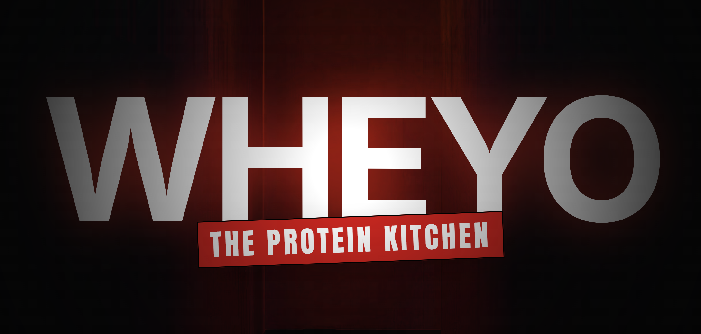
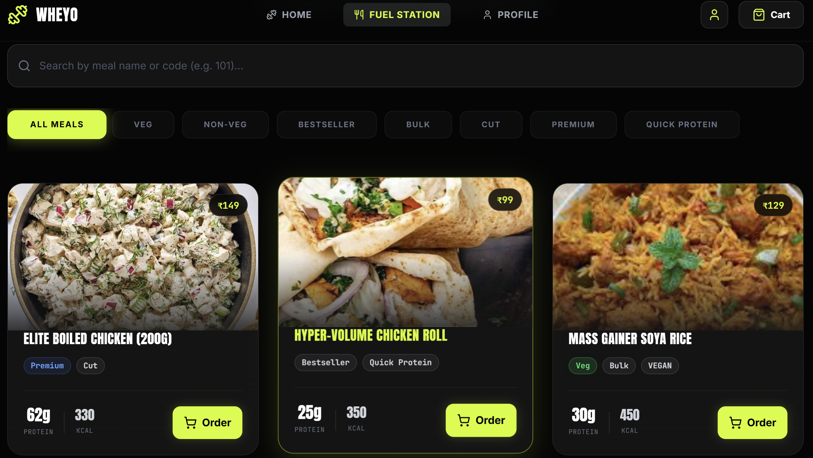
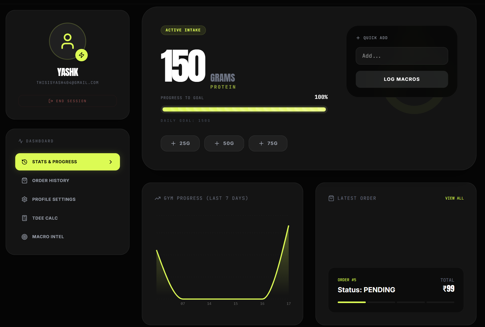
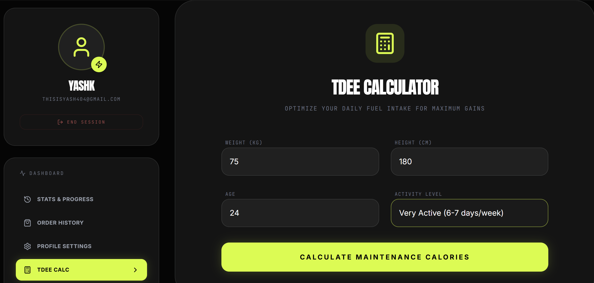

<div align="center">
  
  <p><i>The Hustler's Pride.</i></p>
</div>

# WHEYO: PRECISION FUEL
### *Shattering the gap between "Cafeteria Food" and "Peak Performance"*

[](https://react.dev/)
[](https://tailwindcss.com/)
[](https://supabase.com/)
[](https://vitejs.dev/)

---

**WHEYO** is a high-octane macro-management system for the student-athlete. Designed with a brutalist, high-contrast aesthetic, it delivers precision-tracked protein meals right to your campus doorstep.

[**VIEW THE LIVE SITE**](https://wheyo.vercel.app)

## THE FEATURE STACK

- **MACRO-ZERO TOLERANCE**: Every gram counted. Every calorie verified. View your fuel breakdown before you even add to cart.
- **WHATSAPP WARP-SPEED**: No tedious forms. Just a direct link from your cart to our kitchen via WhatsApp.
- **PROTEIN OVERDRIVE**: A dedicated dashboard to track your gains. Watch your daily intake climb with interactive charts.
- **CAMPUS EXTRACTION POINTS**: Real-time pickup location selection. KLE? VTU? Gogte? We're there.
- **BRUTALIST UI**: High-contrast, motion-heavy interface inspired by performance gear and digital cockpits.

---

## THE TECH OVERLAY

| Component | Technology | Role |
| :--- | :--- | :--- |
| **CORE** | `React 19` | High-Performance Engine |
| **STYLE** | `Tailwind CSS 4.0` | Tactical Visuals |
| **DATA** | `Supabase` | Neural Storage |
| **MOTION** | `Motion.dev` | Kinetic Experience |
| **CHARTS** | `Recharts` | Gain Visualization |

---

## SYSTEM INITIALIZATION

### 1. CLONE THE ARRAY
```bash
git clone https://github.com/your-username/wheyo.git
cd wheyo
```

### 2. INSTALL THE AUGMENTATIONS
```bash
npm install
```

### 3. CONFIGURE THE NEURAL LINK
Create a `.env` file and link the Supabase frequency:
```env
VITE_SUPABASE_URL=your_frequency_url
VITE_SUPABASE_ANON_KEY=your_access_token
```

### 4. GO LIVE
```bash
npm run dev
```

---

## PROJECT ARCHITECTURE (MISSION CONTROL)

```text
src/
├──  components/   # Tactile UI elements & Cart mechanics
├──  pages/        # High-concept views (Menu, Tracker, Success)
├──  lib/          # Supabase synaptic connections
├──  context/      # Global state (Identity & Fuel Cart)
└──  index.css     # The design system
```

---

## THE EXPERIENCE

<div align="center">
  
  <p><i>Your fuel after the 5:00 AM workout.</i></p>
</div>

---

<div align="center">
  
  <p><i>The digital equivalent personal tracker.</i></p>
</div>

---

<div align="center">
  
  <p><i>Get the TDEE Calcutor and plan accordingly!</i></p>
</div>

---

## JOIN THE CORE
Found a bug? Want to optimize the macro-engine? Pull requests are the protein shakes of open source.

## LICENSE
**MIT** - *Code is meant to be free. Gains are meant to be yours.*

<div align="center">
  <br/>
  <b>MADE FOR THE GRIND.</b>
</div>
