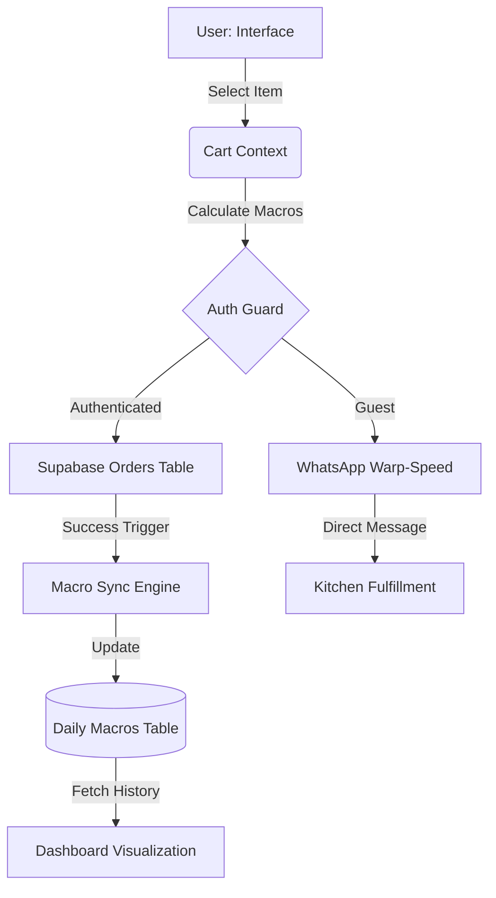
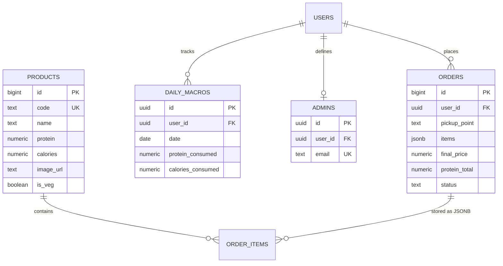

# WHEYO: SYSTEM WORKFLOW & ARCHITECTURE
## Structural Mapping of the Macro-Extraction Engine

> **Project:** WHEYO - Precision Fuel Extraction System
> **Document:** Architectural Workflow
> **Date:** May 17, 2026

---

## 1. Presentation Layer (The UI Cockpit)

The **Presentation Layer** is the primary sensory interface for the user. It is built for high-speed interaction and visual salience.

### Technical Stack
* **Framework**: React 19
* **Styling**: Tailwind CSS 4.0
* **Animations**: Motion.dev (Framer Motion)

### Core Components
* **Dynamic Menu**: High-contrast grid rendering of "Fuel Modules" (Meals) with integrated macro data.
* **Tactical Dashboard**: Real-time visual tracking of protein consumption via Recharts area graphs.
* **Kinetic Cart**: A slide-over interface (CartDrawer) for real-time macro-serialization and cost analysis.

### UX Strategy
Focus on **Brutalist Minimalism**. Reduce cognitive load by highlighting critical data (PRO/KCAL) using Electric Lime accents against a Carbon Black backdrop. All interactions provide immediate haptic-style visual feedback via Motion.

---

## 2. Application Layer (The Logic Engine)

The **Application Layer** orchestrates the movement of data between the user's intent and the system's memory.

### State Management
* **AuthContext**: Manages the "Neural Link" (Supabase Auth sessions) and provides identity verification across the tree.
* **CartContext**: Calculates real-time macro-aggregates and manages transient order state with persistent local caching.

### Workflow Controllers
* **Order Serializer**: Converts cart items into WhatsApp-compatible syntax with URL encoding.
* **Macro Sync Engine**: Intercepts successful orders to update daily protein logs via atomic Supabase upserts.
* **Tactical Calculator**: Processes Mifflin-St Jeor biometric algorithms for the TDEE/BMR display.

---

## 3. Database Layer (The Neural Hub)

The **Database Layer** provides durable, secure, and relational storage for all mission-critical data.

### Infrastructure
* **Engine**: Supabase (PostgreSQL)
* **Security Protocol**: **Row Level Security (RLS)** ensures that users can only interact with data matching their `auth.uid()`.

### Primary Entities
| Entity | Description | Primary Key |
| :--- | :--- | :--- |
| `products` | Master inventory of nutritional modules | `id` (bigint) |
| `daily_macros` | Time-series logs of user consumption | `id` (uuid) |
| `orders` | Transactional history and status logs | `id` (bigint) |
| `admins` | Identity-based access control for overrides | `id` (uuid) |

---

## 4. Data Flow Diagram (DFD)

The following diagram illustrates the flow of a single "Fuel Extraction" mission from selection to gain-security.

---

## 5. Entity Relationship Diagram (ERD)

The visual mapping of the system's relational data structure.

---

  <b>SYSTEM WORKFLOW VERIFIED // FOR THE GRIND. BY THE GRIND.</b>

